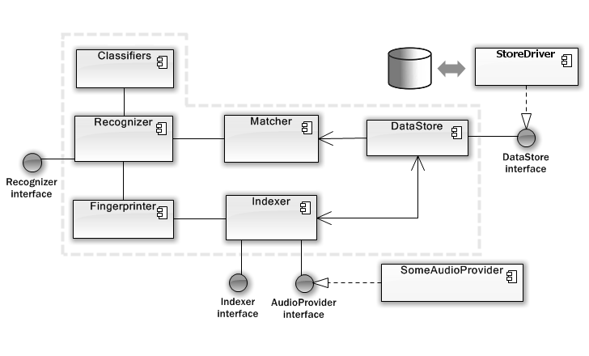

About
=====

Audioneex is an audio content recognition (ACR) engine providing audio fingerprinting 
technology specifically designed for real-time applications. It is general purpose, 
based on content-agnostic algorithms and runs on all kinds of machines, from big 
servers to mobile and embedded devices.

What it is for
--------------

ACR systems can be used in a variety of scenarios, such as broadcast monitoring, 
over-the-air (OTA) identification, content synchronization, second screen, audio 
surveillance, etc. Audio content identification and management technology finds 
applications in a wide range of industries. Following are a few examples of the 
most common use cases:

* User engagement
* Copyright management
* Advertisement
* Piracy detection
* Law enforcement
* Audience metering
* Surveillance & Safety

Audioneex provides the core technology for such applications in the form of a 
C++ cross-platform API that can be integrated as a backend component in web 
services, mobile and desktop apps, embedded systems and more.

Features
--------

* **Highly efficient fingerprinting** - The fingerprints generation is much faster 
  than real-time even on low-end hardware and the resulting fingerprints are very
  small in size. On average, one hour of audio will be encoded in less than 1 MB 
  (in uncompressed form).
  
* **Fast recognitions** - It only requires a few seconds of audio to perform an
  identification (3-4 seconds on average for moderately distorted audio) making
  it suitable for real-time applications.
  
* **Cross-platform API** - Implemented in standard C++ to guarantee native high 
  performances while providing a suitable level of abstraction, it builds and 
  runs anywhere there is a modern C++ compiler (version 11 and above), which means 
  most software/hardware platforms out there.

* **Content-agnostic recognition** - The core algorithms are independent of the 
  nature of the audio to be recognized, allowing the identification of basically 
  any kind of content, from music, to TV and Radio shows, movies, commercials, 
  news, and even generic sounds.
  
* **Flexible recognition system** - By providing several parameters that can
  be set through the API, the engine allows fine-tuning of performances based on 
  the kind of application at hand. 

* **Mobile & IoT-ready** - Its efficient algorithms (and a tiny binary of just a
  few hundred kB) make it suitable for devices with limited resources, such as 
  mobile and embedded platforms, for on-device ACR.

* **Database-neutral** - Designed to be independent of specific storage solutions, 
  it does not lock you into a pre-determined technology and can be used with many
  databases by rewriting the drivers.

Architecture
------------

The architecture is extremely modular, with three main interfaces that abstract 
access to most of the functionality of the engine: ``Recognizer``, ``Indexer`` and 
``DataStore``.

The ``Recognizer`` can be considered as the front-end to all of the identification 
functionality. It deals with the collection of audio supplied by the clients, 
dispatching of the audio to the ``Fingerprinter`` for fingerprint extraction, 
dispatching of the extracted fingerprints to the ``Matcher`` to initiate the search 
of the best candidates, analysis of the results returned by the matching process 
and production of the final results.

The ``Indexer`` provides access to functionality concerning the generation 
of the reference fingerprints. It deals with the collection of audio from 
client applications, initiating the fingerprinting process, processing the 
resulting fingerprints into a format suitable for quick searches and storing the 
data into the appropriate structures. In the context of the Audioneex engine, 
all these processes collectively are referred to as “indexing”, and the outcome 
is the generation of the “reference database”, which is the first step to take 
before using the engine for any recognition operation.

The ``Datastore`` interface is probably the most important entity of the whole 
architecture from the developer's point of view. It provides the specifications 
that clients can follow in order to interface the engine with a specific data 
store. It's an abstraction layer that can be used to write "drivers" for 
different kinds of database. 
This approach allows decoupling from vendor-specific solutions, with the 
consequence of providing a lot of flexibility in the choice of this crucial
component depending on the application. 
For example, a web service may need to use a database based on a client-server 
architecture, whereas an embedded system may require an in-process database for 
on-device recognitions. Data access drivers for two popular high-performance 
databases are provided out-of-the-box and can be used straight away.

